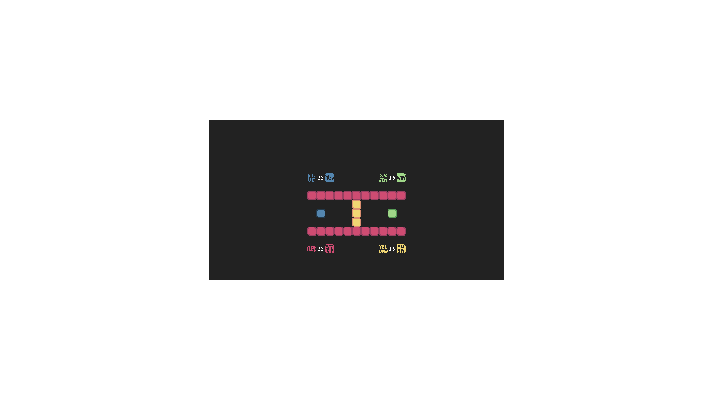

# Blue is You

A recreation of the first level from *Baba Is You* built with Phaser 3, showcasing puzzle mechanics, rule-based interactions, and tile-based movement.

## Controls

| Key              | Action         |
|------------------|----------------|
| `WASD` / `↑←↓→`  | Move           |
| `R`              | Restart        |
| `U`              | Undo           |

## Built With

- Phaser 3
- Javascript 
- HTML5
- CSS